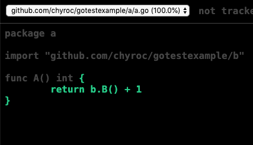
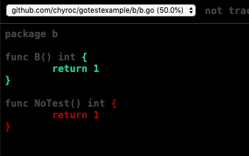

```shell

go test github.com/chyroc/gotestexample/a -coverprofile=coverage.out -covermode=count -coverpkg=./...

go test github.com/chyroc/gotestexample/b -coverprofile=coverage.out.2 -covermode=count -coverpkg=./...

tail -n +2 coverage.out.2 >> coverage.out

go tool cover -html coverage.out -o coverage.html

```



